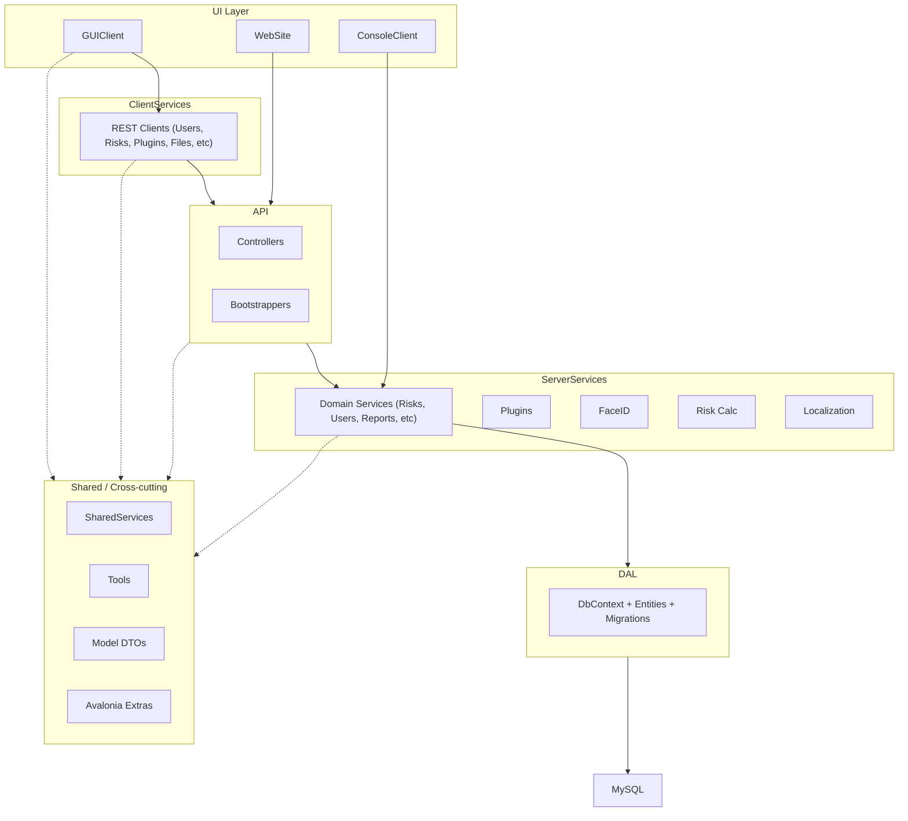

# Arquitetura do Sistema

Diagrama de alto nível simplificado (mantém o conteúdo conceitual, reduz chance de erro de sintaxe Mermaid).

```mermaid
graph TD;

%% ===== Agrupamentos (Subgraphs) =====
subgraph UI [UI Layer];
    GUI[GUIClient];
    WEB[WebSite];
    CLI[ConsoleClient];
end;

subgraph CLISRV [ClientServices];
    CS["REST Clients (Users, Risks, Plugins, Files, etc)"];
end;

subgraph API [API];
    API_CTRL[Controllers];
    API_BOOT[Bootstrappers];
end;

subgraph SRV [ServerServices];
    SRV_CORE["Domain Services (Risks, Users, Reports, etc)"];
    SRV_PLUG[Plugins];
    SRV_FACE[FaceID];
    SRV_CALC[Risk Calc];
    SRV_LOC[Localization];
end;

subgraph DAL [DAL];
    DBCTX[DbContext + Entities + Migrations];
end;

subgraph CROSS [Shared / Cross-cutting];
    SHARED[SharedServices];
    TOOLS[Tools];
    MODEL[Model DTOs];
    AVAUX[Avalonia Extras];
end;

DB["MySQL"];

%% ===== Fluxos Principais =====
GUI --> CS;
WEB --> API;
CLI --> SRV_CORE;
CS --> API;
API --> SRV_CORE;
SRV_CORE --> DAL;
DAL --> DB;

%% ===== Dependências Transversais (pontilhado) =====
SRV_CORE -.-> CROSS;
API -.-> CROSS;
CS -.-> CROSS;
GUI -.-> CROSS;

%% ===== Notas =====
classDef dashed stroke-dasharray: 3 3;
```