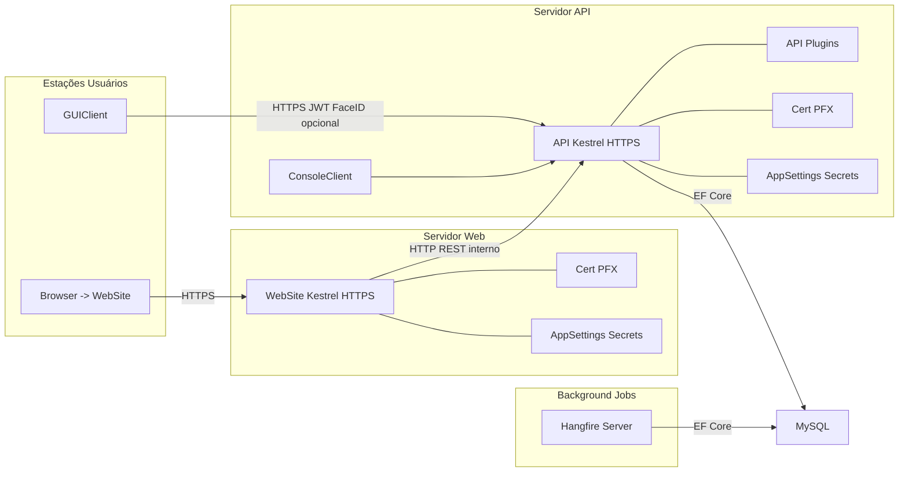

# Deploy

Diagrama de implantação e comunicação entre componentes.

Notas:
- ConsoleClient (AdminCLI) movido para o servidor de API (deploy lado a lado com a API).
- Fluxo direto anterior AdminCLI -> DB substituído por AdminCLI -> API (operações passam pela API).
