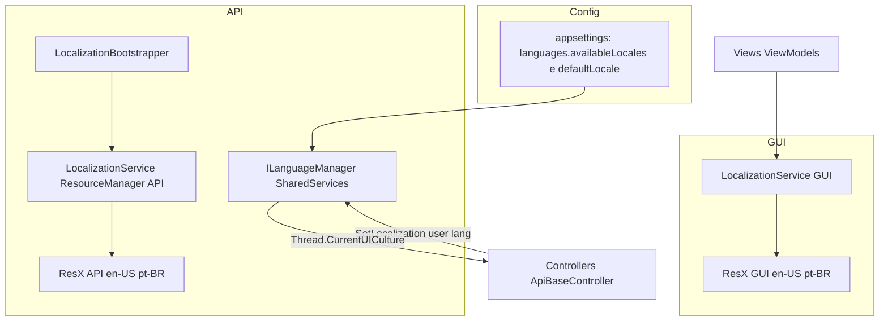

# Sistema Multi‑linguagem

Arquitetura de localização e seleção de idioma.

```mermaid
graph TD
  subgraph Config
    appjson[appsettings: languages.availableLocales e defaultLocale]
  end

  subgraph API
    LocBoot[LocalizationBootstrapper]
    LocSvc[LocalizationService ResourceManager API]
    ILang[ILanguageManager SharedServices]
    ResAPI[ResX API en-US pt-BR]
  end

  subgraph GUI
    LocSvcGUI[LocalizationService GUI]
    ResGUI[ResX GUI en-US pt-BR]
  end

  Controller[Controllers ApiBaseController] -->|SetLocalization user lang| ILang
  ILang -->|Thread.CurrentUICulture| Controller
  LocBoot --> LocSvc
  LocSvc --> ResAPI

  GUIClient[Views ViewModels] --> LocSvcGUI --> ResGUI

  appjson --> ILang
```