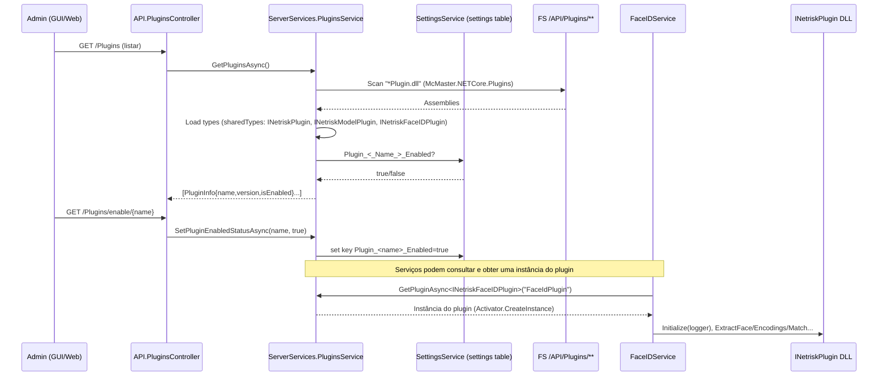

# Sistema de Plugins

Fluxo de descoberta, habilitação e uso de plugins.

```mermaid
sequenceDiagram
  participant Admin as Admin (GUI/Web)
  participant API as API.PluginsController
  participant Svc as ServerServices.PluginsService
  participant Settings as SettingsService (settings table)
  participant FS as FS /API/Plugins/**
  participant FaceID as FaceIDService
  participant Plugin as INetriskPlugin DLL

  Admin->>API: GET /Plugins (listar)
  API->>Svc: GetPluginsAsync()
  Svc->>FS: Scan "*Plugin.dll" (McMaster.NETCore.Plugins)
  FS-->>Svc: Assemblies
  Svc->>Svc: Load types (sharedTypes: INetriskPlugin, INetriskModelPlugin, INetriskFaceIDPlugin)
  Svc->>Settings: Plugin_<_Name_>_Enabled?
  Settings-->>Svc: true/false
  Svc-->>API: [PluginInfo{name,version,isEnabled}...]

  Admin->>API: GET /Plugins/enable/{name}
  API->>Svc: SetPluginEnabledStatusAsync(name, true)
  Svc->>Settings: set key Plugin_<name>_Enabled=true

  Note over FaceID,Svc: Serviços podem consultar e obter uma instância do plugin
  FaceID->>Svc: GetPluginAsync<INetriskFaceIDPlugin>("FaceIdPlugin")
  Svc-->>FaceID: Instância do plugin (Activator.CreateInstance)
  FaceID->>Plugin: Initialize(logger), ExtractFace/Encodings/Match...
```

